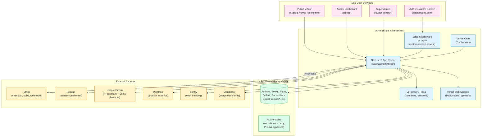

# AuthorLoft — System Architecture

High-level deployment + component view. Renders on GitHub.

## Cron Jobs (Vercel)

| Path | Schedule | Purpose |
|---|---|---|
| `/api/cron/reset-ai-usage` | `0 0 1 * *` | Monthly AI usage reset |
| `/api/cron/cleanup-unverified` | `0 3 * * *` | Daily unverified-account purge |
| `/api/cron/onboarding-cleanup` | `0 4 * * *` | Daily stale onboarding purge |
| `/api/cron/process-social-posts` | `0 9 * * *` | Daily super-admin social posts |
| `/api/cron/expire-trials` | `0 5 * * *` | Daily trial expiration |
| `/api/cron/launch-preorders` | `0 8 * * *` | Daily pre-order launch trigger |
| `/api/cron/social-promote-abuse-check` | `15 * * * *` | Hourly Social Promote abuse digest |

## Notes

- **Single Supabase project** (`fweccazwdlrdbcrdbbev`) — dev branch on staging.authorloft.com hits the same DB as prod, just from a different deploy slot. Migrations are NOT auto-applied on deploy.
- **Custom-domain auth** — author custom domains rewrite to www.authorloft.com via proxy.ts so cookies + sessions stay on the apex.
- **Edge middleware** — proxy.ts handles host-based rewrites; M-6 security middleware is in the same file.
