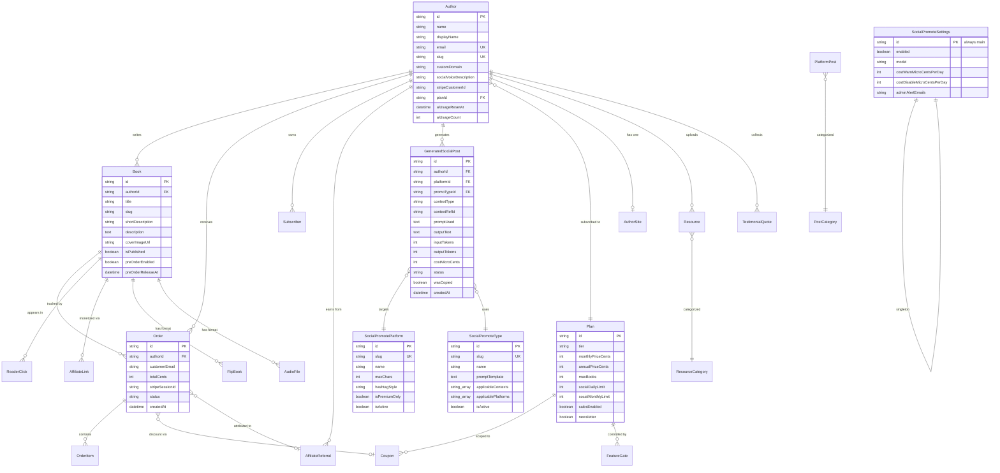

# AuthorLoft — Data Model (ERD)

Core domain. Excludes auth/session tables (`User`, `Account`, `Session`, `VerificationToken`) and analytics dumps.

## Notes

- All money on `Order` / `Plan` / `Coupon` stored as integer cents.
- Social Promote AI cost stored as **microcents** (1 microcent = $0.000001) for precision at fractional-cent scale.
- `contextRefId` on `GeneratedSocialPost` is polymorphic: points at a `Book.id`, `PlatformPost.id` (news), or is null for free-text topic. Type discriminated by `contextType`.
- `SocialPromoteSettings.id` is always `"main"` — enforced via Prisma upsert pattern, no constraint.
- Every new table requires GRANT statements for `anon`, `authenticated`, `postgres`, `service_role` — see `project_supabase_grants.md`.
