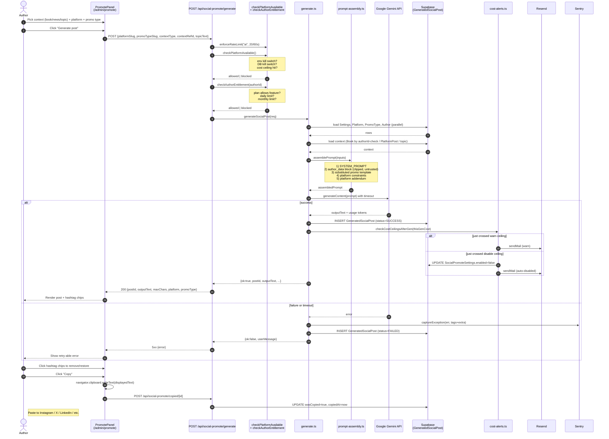
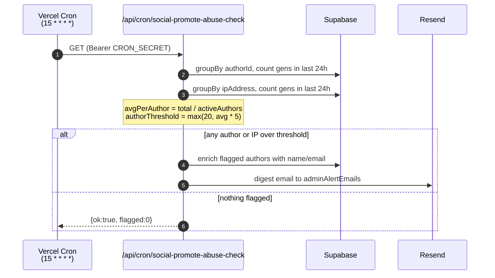

# Social Promote — Generation Sequence

End-to-end flow of one Social Promote generation, from author click to copy-paste.

## Hourly Abuse Check (separate cron)

## Kill-Switch Precedence (highest first)

1. `SOCIAL_PROMOTE_KILL_SWITCH` env var (set + not `"false"`) — instant disable, no DB needed.
2. `SocialPromoteSettings.enabled = false` — manual or auto-tripped via cost ceiling.
3. Daily cost ceiling reached — surfaces in `author-context.ts` as `costCeilingHit`.
4. Per-author plan limits (`socialDailyLimit` / `socialMonthlyLimit`).
5. Rate limiter (20 req / 60s on the `"ai"` bucket).
