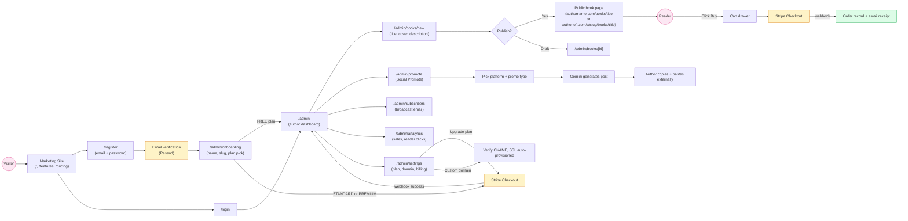

# AuthorLoft — User Flow

End-to-end author journey: discovery → signup → publish → sell → grow.

## Critical Branches

- **Custom-domain visitors** never see authorloft.com — proxy.ts at the edge rewrites them transparently. Author pages load from the same Next.js app.
- **Plan downgrades** keep the author's data intact; features become read-only at the gate. Stripe controls the entitlement state via subscription webhooks.
- **Social Promote** is end-to-end stateless from the author's perspective — they generate, copy, and post manually to the external platform. No OAuth integration in this version.
